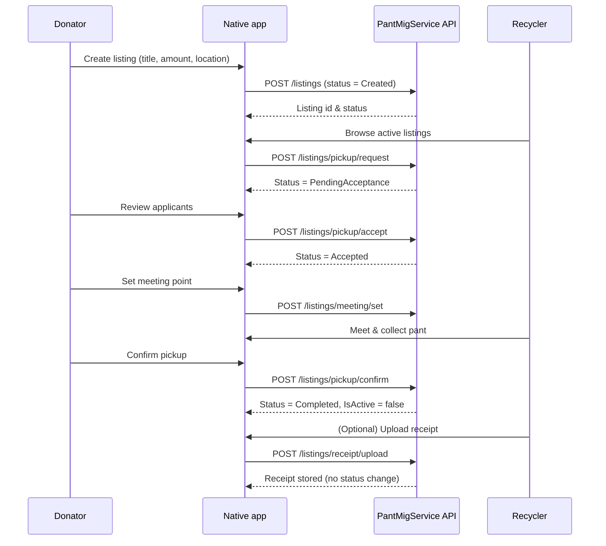
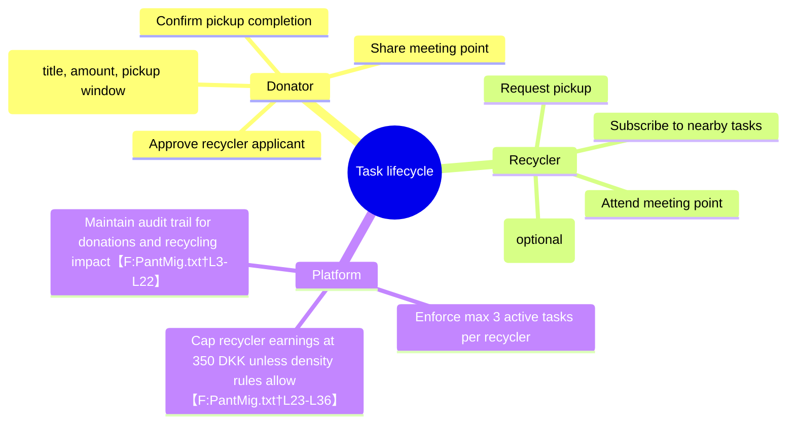

# PantMig Platform Flow Models

This document summarizes how the PantMig platform and its sibling repositories — **PantMigNative**, **PantMigSPA**, and **PantMigService** — collaborate to deliver the end-to-end pant donation experience. The models below combine the textual specifications that live in this mono-documentation repository with the individual project READMEs. They are meant to help new contributors quickly understand user journeys, service responsibilities, and integration points across the ecosystem.

## Repository responsibilities

| Repository | Primary stack | Focus | Key responsibilities |
| --- | --- | --- | --- |
| `PantMig` | Documentation | Product vision | Shared vision, branding assets, and cross-repo documentation such as this file. |
| `PantMigNative` | Expo / React Native | Mobile app | Cross-platform mobile client with authentication, listings map, and task management. Handles token refresh, AsyncStorage, and mobile specific UX.【F:Backend/Backend_Code_Description_Native†L1-L92】|
| `PantMigSPA` | Next.js 15 | Marketing SPA | Public-facing web experience that explains the concept and guides new users through “Sådan virker det”.【F:Backend/Backend_Code_Description_SPA†L1-L120】|
| `PantMigService` | .NET | Core API | Domain logic for listings, pickup flow, chat, meeting points, and completion rules. Exposes REST endpoints consumed by clients.【F:Backend/Backend_Code_Description_Service†L1-L104】|

## System context

```mermaid
flowchart LR
    subgraph Clients
        A[Donator\n(web/mobile)]
        B[Recycler\n(web/mobile)]
    end

    subgraph Frontends
        SPA[ PantMigSPA\nNext.js marketing ]
        Native[ PantMigNative\nExpo mobile app ]
    end

    subgraph Services
        Service[ PantMigService\nCore API (.NET) ]
        Auth[Auth Service\nIdentity + tokens]
    end

    DB[(MongoDB /\nData store)]

    A -- explores concept --> SPA
    B -- explores concept --> SPA

    A -- login, manage listings --> Native
    B -- login, reserve tasks --> Native

    Native -- REST + OpenAPI --> Service
    Native -- OAuth/token flow --> Auth

    Service -- validates tokens --> Auth
    Service -- persists listings --> DB
    Auth -- stores identities --> DB
```

**Figure 1** shows the high-level collaboration. The marketing SPA introduces the service, while the Expo app drives authenticated workflows. Both the app and the service share OpenAPI contracts and rely on dedicated auth endpoints and shared persistence.【F:Backend/Backend_Code_Description_Native†L9-L87】【F:Backend/Backend_Code_Description_Service†L6-L60】

## Core recycle-task lifecycle



**Figure 2** captures the simplified state machine after the pickup confirmation refactor: listings move from `Created` → `PendingAcceptance` → `Accepted` → `Completed`, with receipt uploads treated as optional evidence instead of state transitions.【F:Backend/Backend_Code_Description_Service†L10-L80】

## Client task responsibilities



**Figure 3** highlights the responsibilities per actor that the clients must surface in their UX flows, including business constraints described in the root product notes.【F:PantMig.txt†L3-L36】

## Deployment flow

```mermaid
flowchart TD
    subgraph Dev
        Code[(Code changes)] --> PR[Pull Request]
        PR --> CI[CI checks]
        CI -->|Artifacts| Preview[Preview environments]
    end

    subgraph Production
        Preview --> DeploySPA[Vercel deploy\n(PantMigSPA)]
        Preview --> DeployNative[Expo EAS build\n(PantMigNative)]
        Preview --> DeployService[Azure App Service\n/.NET deploy]
    end

    DeployService --> APIDomain[api.pantmig.dk]
    DeployService --> AuthDomain[auth.pantmig.dk]
    DeploySPA --> WebDomain[pantmig.dk]
    DeployNative --> Stores[App/Play Store]
```

**Figure 4** outlines a recommended release pipeline aligning with the tooling described in the individual README files, connecting the service domains that the mobile app consumes.【F:Backend/Backend_Code_Description_Native†L13-L47】【F:Backend/Backend_Code_Description_SPA†L63-L106】

---

These diagrams should serve as a baseline for onboarding and further architectural discussions. Feel free to evolve them as the platform matures or new services are introduced.
